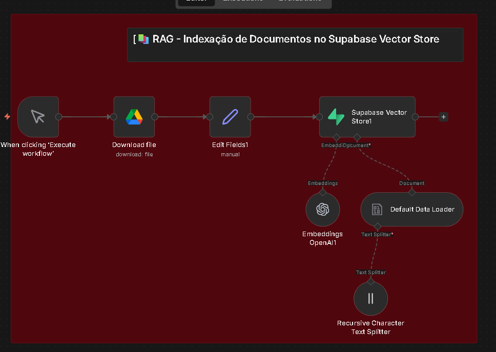

# 🏠 Sistema de Inteligência Imobiliária com n8n

Este projeto apresenta uma automação avançada para o setor imobiliário, integrando agentes de IA e recuperação de documentos (RAG) para otimizar o atendimento ao cliente.

## 🤖 O que este Workflow faz?
* **Agente de Atendimento:** Responde dúvidas de clientes de forma humanizada.
* **Sistema RAG (Retrieval-Augmented Generation):** Consulta uma base de dados de imóveis em tempo real para fornecer informações precisas.
* **Integração Completa:** Conecta o recebimento de mensagens com a lógica de vendas.

## 📸 Visualização do Projeto

### Fluxo do Agente

### Estrutura de RAG (Base de Dados)

## 🛠️ Tecnologias Utilizadas
* **n8n:** Orquestração de workflows.
* **AI Agents:** Para lógica de conversa.
* **Vector Store / JSON:** Para armazenamento e consulta de dados.

## 🚀 Como importar para o seu n8n
1. Baixe o arquivo `AGENTE IMOBILIARIA.json` deste repositório.
2. No seu n8n, vá em **Workflows** > **Import from File**.
3. Selecione o arquivo baixado e configure suas credenciais de IA.
   ## para usar o json precisa:
* Uma conta OpenAI (API Key).
* Um banco de dados Supabase com a extensão pgvector.
* Uma instância da Evolution API configurada.
* Criar a tabela  no Supabase antes de rodar.

## Para criar a tabela e 
